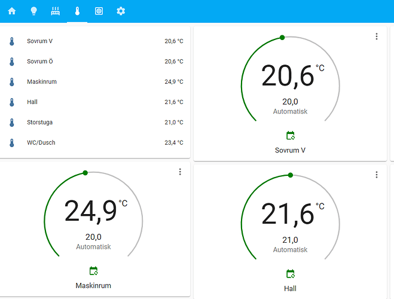
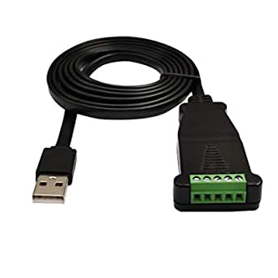

# Integrate LK Systems ICS.2 with Home Assistant
How to setup Home Assistant with modbus integration for LK Systems ICS.2



In this example a USB to RS-485 adapter us used to connect a Home Assistant servier with a ICS.2 floor heating controller from LK Systems.
I have successfully used a `DSD TECH SH-U10L USB to RS485-cable` available from Amazon and many other sources.



Example setup in configuration.yaml:
```yaml
modbus:
  name: dongle_1
  type: serial
  method: rtu
  port: /dev/ttyUSB0
  baudrate: 38400
  stopbits: 1
  bytesize: 8
  parity: N
  climates:
    - name: Sovrum V
      unique_id: climate_sov_v
      slave: 1
      # zon 1
      address: 1001
      input_type: input
      target_temp_register: 1002
      data_type: int16
      precision: 1
      scale: 0.01
      max_temp: 35
      min_temp: 7
      temperature_unit: C

    - name: Sovrum Ö
      unique_id: climate_sov_o
      slave: 1
      # zon 1
      address: 1201
      input_type: input
      target_temp_register: 1202
      data_type: int16
      precision: 1
      scale: 0.01
      max_temp: 35
      min_temp: 7
      temperature_unit: C

  sensors:
    - name: Sovrum V
      unique_id: temp_sov_v
      slave: 1
      # Zon 1
      address: 1001
      input_type: input
      device_class: temperature
      state_class: measurement
      unit_of_measurement: °C
      scale: 0.01
      precision: 1
      data_type: int16

  binary_sensors:
    - name: Heating Sov V
      unique_id: heating_1
      slave: 1
      address: 1003
      input_type: discrete_input
```

If you have more than one USB device connected to your HA hardware it happens that the Modbus dongle appears as a different USB port
after power cycle and/or reboot. You can avoid this problem by using the name from `/dev/serial/by-id` or `/dev/serial/by-path`.
